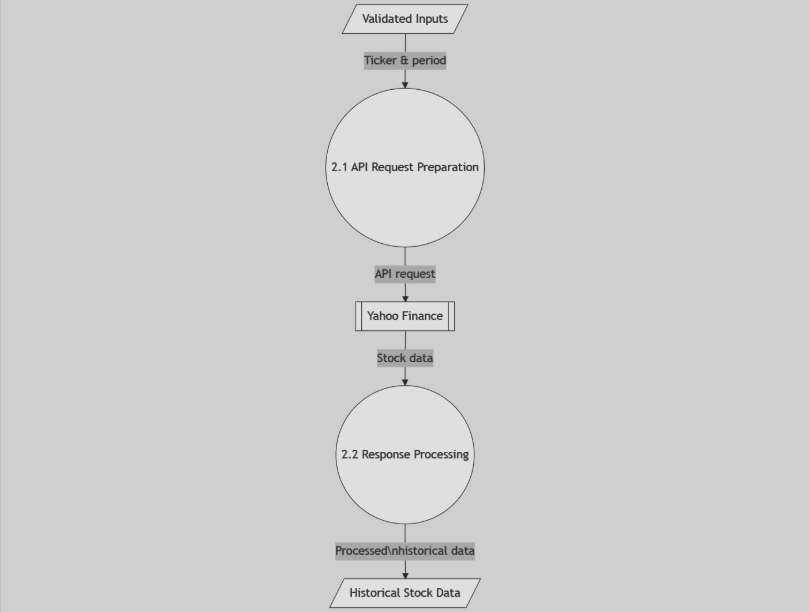

# **CPE334 Final Project Presentation**
## STONKS: Stock Analysis Platform Project By Group 1 Section 31

*This presentation is one of the assessment activities of CPE334 Software Engineering Course of Computer Engineering (International Program), Faculty of Engineering, King Mongkut's University of Technology Thonburi, Semester 1/2024*

---

## Members and Member's Task

- 65070503409		Chayaphon Chaisangkha
- 65070503410		Charunthon Limseelo
- 65070503445		Chanawat Limpanatewin
- 65070503457		Paratthakon	Suksukhon
- 65070503466		Warapol Pratumta
- 65070503469		Sawitt Ngamwilaisiriwong
- 67540460024		Enzo	Foulon
- 67540460028		Tommy Gunawan

---

# **Introduction Section**

---

## Introduction ⭐

In today's rapidly evolving financial landscape, the need for accessible and comprehensive stock analysis tools has become increasingly vital, particularly for newcomers to the investment world. STONKS is a web-based application designed to bridge the gap between complex financial data and informed investment decisions and making stock analysis more accessible to both novice and experienced investors.

---

## What is STONKS? 📈

STONKS is being developed as a comprehensive stock analysis and visualization platform that combines powerful analytical tools with an intuitive user interface. The project aims to democratize financial analysis by providing users with professional-grade tools wrapped in an accessible format. By integrating stock screening and important information for investors, STONKS creates a unified platform that serves both as an analytical tool and a learning environment.

---

## Problem Statement 🤔

Many potential investors face significant barriers when entering the stock market, including:
- Complexity of financial data and analysis
- Difficulty in making informed investment decisions
- Limited access to comprehensive educational resource

---

## Project Objectives 🤗

1. Simplify the stock analysis process through intuitive visualization and screening tools
2. Empower users with clear analytical insights and company information as the factors for investment.
3. Offer predictive analytics and risk assessment tools through using real-time machine learning for considering whether to choose to invest or not.

---

## Target Group 🧑‍🤝‍🧑

1. Novice investors seeking to enter the stock market
2. Experienced investors requiring comprehensive analysis tools
3. Individuals interested in learning about business and finance
4. Users seeking a unified platform for portfolio management and analysis

---

## Main Features
 
1. Stock Visualization Interactive Dashboard with Prediction Graph
2. Mobile Web App Compatibility

---

## Functional Requirements

1. Stock Quotes and Market Data
2. Interactive Charts with Prediction
3. Valuation metric computation

---

## Non-functional Requirements
1. Usability
    - Easy-to-use interface
    - Intuitive Navigation
2. Performance
    - Fast loading times
    - Responsive Design
3. Reliability
    - System uptime and stability
    - Data accuracy and integrity

---

## Non-functional Requirements (cont.)
4. Scalability
    - Ability to handle increasing user loads and data volumes
5. Maintainability
    - Ease of updating and modifying the system
6. Portability
    - Compatible with different devices.

---

# **Elicitation/Requirements Gathering**

---

## Interviews

- Conduct interviews with investors or stock interests to understand their needs for stock analysis, which we could get some insights for adapting for our group project for having better features

---

## Observation
- Spend time observing some investors or stock interests on using other software (Google Finance, Yahoo Finance, Jitta), focusing on how their stock analysis is being managed and how the value of the stock has been predicted to get the future result, along with other factors for investment.

---

## Workshop Session

- Organize a workshop involving multiple stakeholders to collaboratively discuss the desired features and identify conflicting requirements of the stock analysis platform.

---

## Prototyping
- Create a prototype of the STONK stock analysis platform for gathering feedback on usability and feature preferences.

---

# **Software Architecture**

---

## Context-level DFD

---

## Level-1 DFD

---

## Level-2 DFD: Form Collector of the Stock Ticker

---

## Level-2 DFD: API Retriever from Yahoo Finance

---

## Level-2 DFD: Predictor/Forecaster

---

## Level-2 DFD: Graph Visualizer

---

## Class Diagram

---

## Sequence Diagram

---

# **Functional UI Designs**

---

# **Demonstration Time**

---

# **Working Process**
Sprint 1: Homepage and UI Design
Sprint 2: Graph Designing 
Sprint 3: Backend management on API (Yahoo Finance)
Sprint 4: Model Training for Prediction Features

> Each sprint takes 2 weeks in process.

---

# **Some Aj. Chaiyong's Inspirations On the Project**
- **HCI and UI Design**: We would try to make it clean and being responsive for many devices as it can be used to watch the stock analysis.
- **System Cohesion**: For the class diagram, we are trying to make the system to be systematic and organizing to be more efficient on running the symple software with the many backend process working for the platform.
- **Version Control**: For our project, we try to implement our code and save within GitHub Repository for many commits as possible for preventing the accident of some errors of the code in the project. At some point, we can recall or roll back the previous version of the code if we found the problem when somebody in the group accidentally push the errors in the repository.

---

# **Business Analysis for Further Developments**

---

# **Conclusions**

- **Democratizing Finance**: Simplifies financial analytics for both novice and experienced investors.
- **Innovative Features**: Interactive dashboards and ML-powered predictions
- **User-Centric Development**: Iterative design using Scrum and feedback from interviews/workshops.
- **Key Strengths**: Ease of use, comprehensive tools, and intuitive design.
- **Improvement Areas**: UI theme refinements, enhanced homepage content, and deeper insight and engagement.
- **Future Focus**: Design system optimization, advanced analytics, and content enhancements.

---

# **Thank You For Watching! 🙏❤️**
## **Any Questions? 🙋‍♂️🙋‍♀️❔**